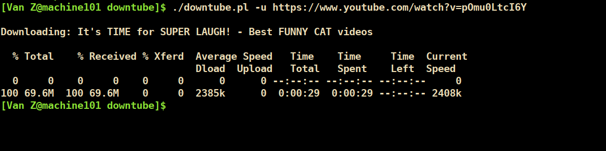
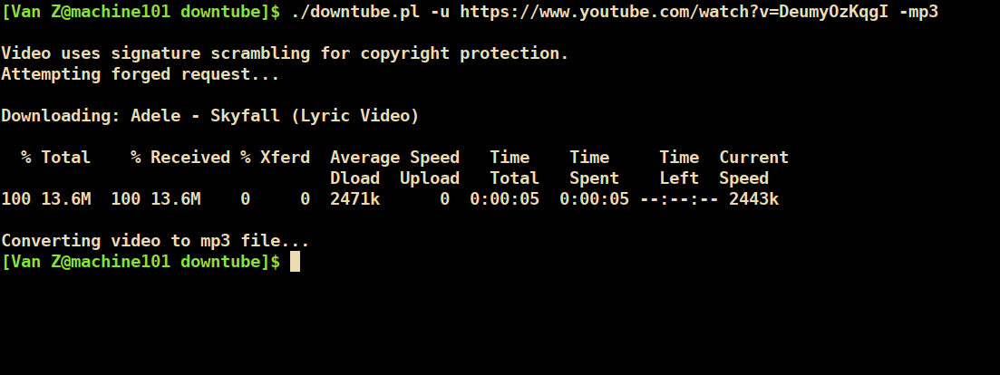

# Downtube
Simple Youtube downloader

**CURRENT STATUS (06.10.2024)**: This tool is now archived. The recent changes to the YouTube API would necessitate a thorough overhaul of the code, for which I currently don't have the time and resources. Hence, *DownTube*'s further development is postponed (for the time being). Perhaps it might still serve as a callback to simpler, pre-BIG-DATA-scraped times...

[Description](#description)

[Prerequisites](#prerequisites)

[Installation](#installation)

[Usage](#usage)

[Screenshots](#screenshots)

[Limitations](#limitations)

## Description
As the name implies, *Downtube* is a small commandline tool for downloading (and optionally converting) Youtube videos. 
Bringing back the good old days when webpages were actual pages whose assets could be fetched with a simple curl command, 
*Downtube* is very shellscript-ish, tackling its mission with a series of calls to external programs. 
(So no Perl LWP or other libraries, sorry.)

Modify and extend as you wish.

(As of late 2019, the Youtube API has changed significantly, apparently dropping the old `fmt_stream_map` 
and relying primarily on a JSON array of separate audio and video streams. In response to this, *Downtube*'s
design has evolved into something more complex, while still trying to preserve its "shellscript" nature.) 

## Prerequisites
Only Unix-like systems are officially supported, but you might get the program to run on Windows with something
like [Cygwin](https://www.cygwin.com/). (If you find yourself trying to download Youtube videos from
within an emulated shell within an emulated Linux environment within a Microsoft environment, 
then you have very peculiar taste indeed, my friend.)

List of dependencies:
###### Required
* [curl](https://curl.haxx.se/): For downloading.
* [ffmpeg](https://ffmpeg.org/): For combining audio and video streams or converting audio to mp3.

###### Optional 
* [nodejs](https://nodejs.org/en/): For signature scrambling.

Most distros should already come with curl pre-installed and ffmpeg in the repos. The nodejs dependency is 
only relevant for videos employing Youtube's signature scrambling pseudo-protection scheme. 
In order to download such videos, the script needs to emulate expected browser behavior. That is:

* Extract the "signature" string from the video url.
* Load the Javascript scrambler from the page sources.
* Feed the string to the scrambler and append the result to the video url.

Strictly speaking, *Downtube* doesn't require the nodejs framework in its entirety. 
Any Javascript interpreter will do, in fact. So, again, feel free to customize.

## Installation
Download the latest version from the [Release](https://github.com/Van-Ziegelstein/Downtube/releases) page and you
should be ready to go.

## Usage
Invoking *Downtube* should be straightforward:

`./downtube -u <youtube video url> [ -mp3 ] [ -debug ]`

The script will parse the page source and try to locate the available
video streams. Without the `-mp3` flag, *Downtube* will present the user
with two lists: one containing all m4a audio streams, the other one mp4 video streams
(other formats are filtered out, for simplicity). The selected streams will be downloaded
and combined into the final file.

##### Required parameters

`-u <youtube video url>`: The url of the video you wish to download.

##### Options

`-mp3`: Convert the video to a mp3 file after download.

`-debug`: This option is primarily intended for development purposes and will make the script output **a lot** more info. 

`-help`: Print some helpful stuff to the console.

## Screenshots 

| Downloading a normal youtube video | Downloading a protected video and converting to mp3 |
| ---------------------------------- | --------------------------------------------------- |
|   |                    |

## Limitations
* This is a tool for downloading Youtube videos and **only** Youtube videos. Other sites like Dailymotion, [insert name]-Tube etc.
are not covered.

* Downloading age restricted videos is not supported. Might or might not change in the future.

* The script does not (yet) try to bypass Youtube's throttling mechanism during stream download.

* More fancy download options like automatic playlist traversal, http proxies or geo-ip bypass are not implemented (and that
likely won't change). If you absolutely require such functionality, then I suggest looking for more complete solutions. 

## Authors
**Van Ziegelstein** - Creator and Maintainer

## License
This project is licensed under the [MIT License](LICENSE).
